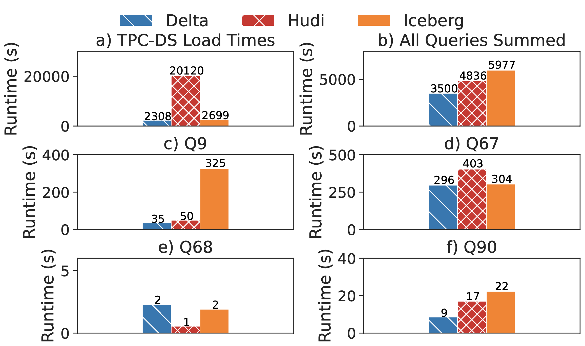
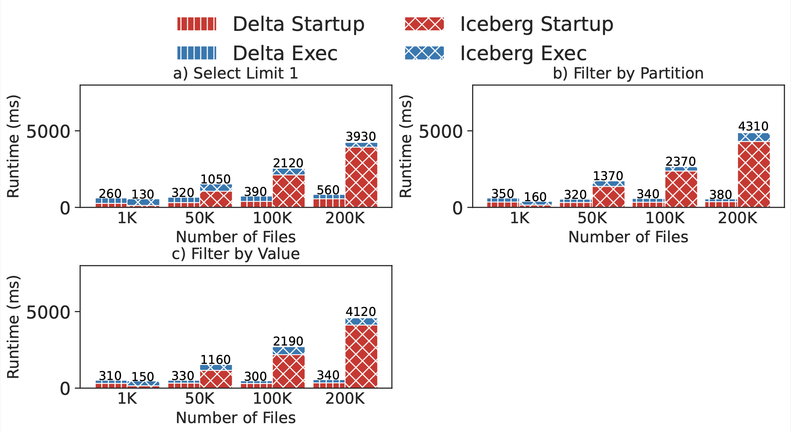
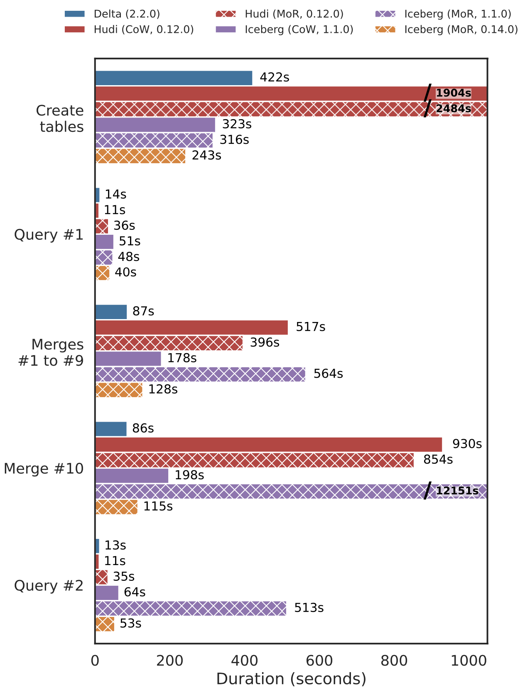
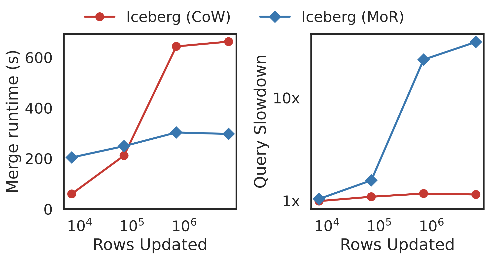

# Introduction

LHBench is a benchmark for [LakeHouse](https://www.cidrdb.org/cidr2021/papers/cidr2021_paper17.pdf) storage systems. These systems extend traditional Data Lake storage with support for ACID transactions and enable a wide range of workloads from data warehousing to machine learning in one place. LakeHouse architectures are widely adopted in industry at companies such as Uber, Meta, and Netflix. Our benchmark runs on AWS EMR and currently supports three LakeHouse storage engines: [Apache Iceberg](http://iceberg.apache.org), [Apache Hudi](http://hudi.apache.org), and [Delta Lake](http://delta.io). This benchmark is meant to enable simple and reproducible comparison of storage engines in this rapidly moving space.

[CIDR paper](https://www.cidrdb.org/cidr2023/papers/p92-jain.pdf)

# Workload
Our goal with this benchmark is to study end-to-end workloads and understand the technical differences between LakeHouse systems. We chose to adapt the existing TPC-DS data warehouse benchmark to the LakeHouse setting wherever possible to exercise these differences. This benchmark is made up of four tests, three of which use the TPC-DS dataset and a subset of the TPC-DS queries. The last test, micro merge, performs inserts and updates to a synthetic dataset at a fine granularity. The TPC-DS Refresh and Micro Merge tests are meant to exercise differences in UPDATE implementations, Large File Count TPC-DS exercises differences in metadata handling, and TPC-DS exercises end-to-end performance.

The benchmark is made up of four tests:
* 3TB TPC-DS
* Large File Count TPC-DS
* TPC-DS Refresh
* Micro Merge Comparison

# Results | December 2022
All experiments were run using Apache Spark on AWS EMR 6.9.0 storing data in AWS S3 using Delta Lake 2.2.0, Apache Hudi 0.12.0, and Apache Iceberg 1.1.0. This version of EMR is based on Apache Spark 3.3.0. More details on these runs can be found in the [paper](https://www.cidrdb.org/cidr2023/papers/p92-jain.pdf).
				
## 3TB TPC-DS Results

Our end-to-end comparison of Delta, Hudi, and Iceberg with 3TB TPC-DS runs each query three times and reports the median runtime. The results show Hudi is almost ten times slower for data load. This is because Hudi is optimized for keyed upserts, not bulk data ingestion, and does expensive pre-processing during data loading including key uniqueness checks and key redistribution. Our query runs showed that overall, TPC-DS ran 1.4× faster on Delta Lake than on Hudi and 1.7× faster on Delta Lake than on Iceberg. We highlight some of the specific queries where the differences were pronounced. Upon investigation we found that the query execution time differences are explained almost entirely by data reading time. You can find a more detailed discussion in the [paper](https://www.cidrdb.org/cidr2023/papers/p92-jain.pdf).
					
## Large File Count TPC-DS Results

The large file count test compares metadata processing strategies across LakeHouses. We break the store_sales TPC-DS table up into 10MB files and experiment with 1,000 through 200,000 files. We see better performance from Delta Lake for large file counts. Performance is 7x-20x better for Delta in the 200,000 files case.

## TPC-DS Refresh Results

This test first loads the 100 GB TPC-DS base dataset, then runs five sample queries (Q3, Q9, Q34, Q42, and Q59). It then runs a total of 10 refreshes (each for 3% of the original dataset) using the MERGE INTO operation to update rows. Finally, it reruns the five sample queries on the updated tables. Due to S3 connection timeouts in Iceberg 1.1.0 MoR we also show results for Iceberg 0.14.0 MoR. 		 	 	 				
We observed that merges in Hudi MoR were 1.3× faster than in Hudi CoW at the cost of 3.2× slower queries post-merge. Both Hudi CoW and MoR had poor write performance during the initial load due to additional pre-processing to distribute the data by key and rebalance write file sizes. Delta’s performance on both merges and reads was competitive, despite using only CoW, due to a combination of generating fewer files, faster scans, and a more optimized MERGE command. Merges in Iceberg version 0.14.0 with MoR were 1.4× faster than CoW. Post-merge query performance remains similar between table modes. 
					
## Micro Merge Results

The micro merge test uses a synthetic dataset of four columns in a single table. In this run we have generated a 100GB data set and we compare merge time and post-merge query time for a range of update sizes. The update sizes range from 0.0001% of the data set size to 0.1% of the data set size. We see that MoR merge time starts to outperform CoW at 100,000 rows updated. We also see, as expected, that the query latency after a merge is much higher for merge-on-read than copy-on-write due to read amplification.

# FAQ

### Have you run this benchmark on a traditional data warehouse?

This benchmark is aimed at highlighting design choices between specifically LakeHouse storage systems. Many data warehouses have had TPC-DS and TPC-DS Refresh run against them which could be used as points of comparison, but the large file count and micro merge benchmarks are meant to highlight aspects of LakeHouse system design that don’t apply to traditional data warehouses.

### What are CoW and MoR?

These are different approaches to implementing updates. The Copy-On-Write (CoW) strategy identifies the files containing records that need to be updated and eagerly rewrites them to new files with the updated data, thus incurring a high write amplification but no read amplification. The Merge-On-Read (MoR) strategy does not rewrite files. It instead writes out information about record-level changes in additional files and defers the reconciliation until query time, thus producing lower write amplification (i.e., faster writes than CoW) but higher read amplification (i.e., slower reads than CoW).

# [Instructions](experiment-instructions.md) To Try This Benchmark Yourself
